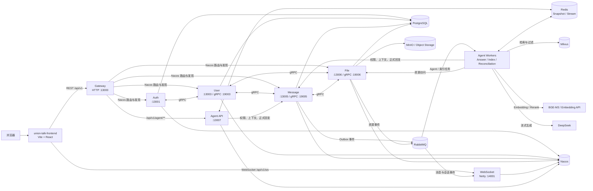

# Union Talk

Union Talk 是一个面向日常沟通的全栈协作与 AI 对话工作空间。它把即时通信、好友与群组、文件资产、实时事件和会话 Agent 放在同一个产品里：普通消息通过 WebSocket 实时分发，`@AI` 请求由独立的 Agent 服务执行，并支持流式状态、执行轨迹、引用和基于会话权限的 RAG 检索。

这是一个单仓库多服务项目，包含 React 前端、Java 业务后端和 Python Agent 微服务。当前核心链路已经实现，生产压测、灰度发布和 Agent 独立公网鉴权仍属于后续工作。

## 目录

- [核心能力](#核心能力)
- [架构总览](#架构总览)
- [核心链路](#核心链路)
- [仓库结构](#仓库结构)
- [技术栈](#技术栈)
- [快速开始](#快速开始)
- [服务入口与端口](#服务入口与端口)
- [开发与验证](#开发与验证)
- [部署](#部署)
- [配置与安全](#配置与安全)
- [项目文档](#项目文档)
- [开发约定](#开发约定)
- [路线图](#路线图)
- [维护者与许可证](#维护者与许可证)

## 核心能力

| 领域 | 当前能力 |
| --- | --- |
| 账户与社交 | 注册登录、用户资料、好友关系、好友申请、好友分组、群组与成员管理 |
| 会话与消息 | 单聊和群聊、多类型消息、消息提及、会话更新和消息历史 |
| 实时通信 | Netty WebSocket 连接鉴权、在线状态、心跳、消息和会话事件推送 |
| 文件资产 | 文件夹、文件上传、资产访问权限、临时下载和资源生命周期事件 |
| 会话 Agent | `@AI` 触发、会话级 Agent 配置、Run 管理、取消、快照、轨迹和 SSE 恢复 |
| 知识检索 | PDF/JSON 等资源解析、扫描 PDF OCR、层次化切块、Embedding、混合召回和引用 |
| 服务治理 | Nacos 注册与发现、Gateway 路由、gRPC 服务契约、RabbitMQ Outbox 事件和 Redis 实时状态 |

## 架构总览



系统有三条边界：

1. 浏览器只访问 Gateway 的 HTTP 接口和 WebSocket，不直接访问 User、Message、File 或 Agent 内部服务。
2. Message Service 是聊天消息和 Agent 正式回复的唯一写入口；File Service 是资源内容和资源权限的唯一来源。
3. Agent 通过 Message/File 的 gRPC 契约获取权限、上下文和资源内容，Milvus 只保存可重建的向量与过滤元数据，最终结果还要回 PostgreSQL 校验当前资源版本和状态。

## 核心链路

### 普通消息与实时推送

1. 前端通过 Gateway 调用认证、用户、会话、消息和文件 REST 接口。
2. Message Service 在 PostgreSQL 中保存消息和会话状态，并发布 `MESSAGE_CREATED`、会话更新等 RabbitMQ 事件。
3. WebSocket Service 消费事件，按用户和连接把变更推送到浏览器。
4. WebSocket 连接在握手后完成 Sa-Token 鉴权，Redis 保存在线状态和连接辅助信息。

### `@AI` Agent 请求

1. 前端通过 `/api/v1/agent/**` 请求 Agent 配置、Run、快照、轨迹和 SSE 事件；Gateway 去掉服务路由前缀并注入可信用户身份。
2. Message Service 把 Agent 提及写入 Outbox，RabbitMQ 将 `AGENT_MENTIONED` 投递给 `answer-worker`。
3. Worker 通过 Message gRPC 校验会话权限并读取紧凑上下文，通过 File gRPC 获取可访问资源，再从 PostgreSQL 和 Milvus 召回当前会话证据。
4. LangGraph 编排模型调用、工具步骤和引用。实时卡片状态写入 Redis Stream，前端通过 SSE 游标恢复流式事件。
5. Agent 生成正式回复后仍由 Message Service 写入消息真源，再通过 WebSocket 推送；临时 Agent 卡片随后被正式消息替换。

### 文件资产与 RAG 索引

1. File Service 处理上传、文件夹、权限和临时下载，并记录资源生命周期。
2. 资源变更通过 Outbox 和 RabbitMQ 投递给 `index-worker`。
3. Worker 读取资源内容，解析 PDF/JSON/文档，必要时执行 OCR，然后进行 Parent/Child 层次化切块。
4. Embedding API 使用 BGE-M3 生成向量并写入固定的 `union_talk_rag_v2` Collection；查询结果必须回 PostgreSQL 做权限、版本和 `READY` 状态校验。

## 仓库结构

```text
.
├── union-talk-frontend/          # Vite + React + TypeScript 前端
│   ├── src/app/                  # 应用入口与路由
│   ├── src/components/           # 认证、会话、文件、Agent 与通用组件
│   ├── src/hooks/                # 页面业务状态与数据编排
│   ├── src/pages/                # 登录、主页、好友、群组、通知和设置
│   └── src/services/             # HTTP、WebSocket、Agent 和生成 API 契约
├── union-talk-server/            # Java 21 + Spring Boot 多模块后端
│   ├── union-talk-gateway/       # 统一 HTTP 入口与 Agent 身份转发
│   ├── union-talk-auth/          # 注册、登录和认证流程
│   ├── union-talk-core/
│   │   ├── union-talk-user/      # 用户、好友、群组和权限
│   │   ├── union-talk-message/   # 会话、消息、提及和 Agent 回复
│   │   └── union-talk-file/      # 文件、文件夹、资产权限和 Outbox
│   ├── union-talk-websocket/     # Netty WebSocket 与事件推送
│   ├── union-talk-common/        # 基础设施、数据源、gRPC、MQ、存储等共享模块
│   └── deploy/docker/            # 六个后端服务的镜像部署 Compose 文件
├── union-talk-agent/             # Python 3.13 + FastAPI + LangGraph Agent
│   ├── src/union_talk_agent/
│   │   ├── access_control/       # 会话成员与管理权限
│   │   ├── agent_config/         # 会话 Agent 配置
│   │   ├── agent_run/            # Run 聚合、LangGraph 与实时事件
│   │   ├── event_inbox/          # RabbitMQ 至少一次投递幂等
│   │   ├── knowledge/             # 解析、切块、索引与检索
│   │   ├── infrastructure/       # PostgreSQL、Redis、MQ、gRPC、Nacos、Milvus 和模型适配器
│   │   ├── interfaces/           # FastAPI HTTP 接口
│   │   └── bootstrap/             # API、Worker 和 Embedding 入口
│   ├── alembic/                  # Agent 控制面迁移
│   ├── proto/                    # Agent 使用的 gRPC 生成契约
│   └── tests/                    # 单元测试和契约测试
├── .github/workflows/release-production.yml # Tag 生产发布与多架构镜像
├── docs/production-release.md   # GHCR、Tag 和服务器配置
├── .gitignore
└── README.md
```

## 技术栈

| 层 | 技术 |
| --- | --- |
| 前端 | React 19、TypeScript、Vite、React Router、Axios、Tailwind CSS、shadcn/ui、Tiptap、Vitest |
| Java 后端 | Java 21、Spring Boot 3.5、Spring Cloud、Spring Cloud Alibaba、MyBatis、gRPC、Protobuf、Netty |
| Agent | Python 3.13、FastAPI、LangChain、LangGraph、Pydantic、SQLAlchemy、Alembic、uv |
| 数据与消息 | PostgreSQL、Redis、RabbitMQ、Seata、Milvus、MinIO |
| 服务治理 | Nacos、Gateway 路由、gRPC 服务发现、Docker Compose |
| AI 与文档 | DeepSeek、BGE-M3、PDF/JSON/Office 文档解析、Poppler、Tesseract OCR |

## 快速开始

### 1. 获取代码

```bash
git clone https://github.com/wzh-devin/union-talk.git
cd union-talk
```

### 2. 准备外部依赖

完整链路依赖 PostgreSQL、Redis、RabbitMQ、Nacos、Seata、MinIO 和 Milvus。当前 Compose 文件主要负责应用服务，依赖服务需要先在本机或开发环境中准备好。请把实际地址、账号和密码写入各服务的本地 `.env`，不要提交真实配置。

### 3. 启动 Java 后端

```bash
cd union-talk-server

# 本地构建全部模块
mvn -DskipTests package

# 或按部署文档准备镜像并启动应用服务
cd deploy/docker
cp .env.example .env
# 编辑 .env 后按 README 中的顺序启动 User、Message、File、Auth、WebSocket、Gateway
```

部署顺序、Nacos 配置、Seata 配置和逐服务 Compose 命令见 [`union-talk-server/deploy/docker/README.md`](union-talk-server/deploy/docker/README.md)。

### 4. 启动 Agent

```bash
cd union-talk-agent
cp .env.example .env
uv sync --locked --all-groups
uv run alembic upgrade head

# API
uv run agent-api

# 独立进程：按需分别启动
uv run answer-worker
uv run reconciliation-worker
uv run embedding-api
uv run index-worker
```

Agent 的环境变量、Nacos 注册、SSE、Redis Key、Milvus Collection 和 OCR 前置依赖见 [`union-talk-agent/README.md`](union-talk-agent/README.md)。本机处理扫描 PDF 时还需要 Poppler、Tesseract 和 `chi_sim` 语言包。

### 5. 启动前端

```bash
cd union-talk-frontend
cp .env.example .env.local
pnpm install
pnpm dev
```

默认前端使用 `http://localhost:13000` 作为 Gateway、`ws://localhost:14001` 作为 WebSocket 代理。完整变量说明见 [`union-talk-frontend/README.md`](union-talk-frontend/README.md)。

## 服务入口与端口

| 服务 | 默认入口 | 用途 |
| --- | ---: | --- |
| Gateway | `13000` | 浏览器 HTTP 入口、路由和可信身份转发 |
| Auth | `13001` | 注册、登录和认证 |
| User | `13003` / gRPC `19003` | 用户、好友、群组和成员权限 |
| WebSocket | HTTP `13004` / Netty `14001` | 实时连接、鉴权、心跳和事件推送 |
| Message | `13005` / gRPC `19005` | 会话、消息、提及、Outbox 和 Agent 回复 |
| File | `13006` / gRPC `19006` | 文件、文件夹、资产权限和资源内容 |
| Agent API | `13007` | Agent 配置、Run、轨迹、快照、取消和 SSE |
| Embedding API | `13008` | BGE-M3 Embedding 与 Rerank 内部接口 |

端口可以通过对应 `.env` 或 Nacos 配置覆盖；表中值是当前开发配置中的默认值。

## 开发与验证

前端：

```bash
cd union-talk-frontend
pnpm typecheck
pnpm lint
pnpm test
pnpm format:check
pnpm build
```

Agent：

```bash
cd union-talk-agent
uv run ruff format --check src tests
uv run ruff check src tests
uv run pyright
uv run pytest
```

Java 后端使用 Maven 多模块构建；涉及数据库、Nacos、Redis、RabbitMQ、Seata 或对象存储的验证需要先准备对应基础设施。跨服务契约位于 `union-talk-server/union-talk-common/union-talk-grpc/` 和 `union-talk-agent/proto/`。

## 部署

生产部署采用“构建机生成镜像，部署机只拉取镜像”的方式。六个后端应用的独立 Compose 文件位于 [`union-talk-server/deploy/docker/`](union-talk-server/deploy/docker/)，前端生产清单位于 [`union-talk-frontend/docker-compose.production.yaml`](union-talk-frontend/docker-compose.production.yaml)，Agent 的生产进程编排位于 [`union-talk-agent/docker-compose.production.yaml`](union-talk-agent/docker-compose.production.yaml)。

生产 Tag 发布、GHCR 镜像命名、按服务更新和 GitHub Environment 配置见 [`docs/production-release.md`](docs/production-release.md)。

部署前至少完成以下准备：

- Docker Engine 和 Docker Compose V2；
- 可访问的镜像仓库；
- Nacos Namespace、配置和服务发现；
- PostgreSQL、Redis、RabbitMQ、Seata、MinIO、Milvus；
- 部署主机到中间件的网络连通性；
- 生产环境中的密钥、账号、域名和 TLS 配置。

不要把生产 `.env`、Nacos 密码、模型 API Key、对象存储凭据或加密主密钥写入 Git。

## 配置与安全

- 浏览器不直接连接 Agent；Agent API 只接受 Gateway 的可信内网调用。
- Gateway 会校验用户身份并覆盖转发的 `X-User-Id`，Agent 不信任浏览器自行构造的角色或用户标识。
- Message Service 负责聊天消息和正式 Agent 回复的写入；File Service 负责资源内容和访问权限。
- PostgreSQL 保存控制面和运行状态；Milvus 保存可重建向量，不作为业务权限真源。
- 本地配置从 `.env.example` 复制，真实 `.env` 已被 Git 忽略。
- 如果 Agent 将来独立暴露到公网，需要先增加 Token Introspection 或独立 OIDC 鉴权。

## 项目文档

- [Agent 服务说明](union-talk-agent/README.md)：Agent API、Worker、SSE、RAG、Milvus 和数据库约束。
- [前端服务说明](union-talk-frontend/README.md)：Vite、React、目录约定和前端命令。
- [Java Docker 部署说明](union-talk-server/deploy/docker/README.md)：镜像、Compose、Nacos、Seata、启动顺序和部署验证。
- [Agent 交互流程](union-talk-agent/docs/agent-interaction-flow.md)：Agent 请求、事件和实时状态流程。
- [后端验证记录](union-talk-server/verification.md)：历史变更的静态验证和运行限制。

## 开发约定

- 浏览器访问 Gateway，服务之间通过 gRPC、RabbitMQ 和 Nacos 协作。
- Message Service 是消息真源，File Service 是资源与权限真源；其他服务通过契约访问，不跨服务直读业务表。
- Agent 采用 `Interfaces / Bootstrap → Application → Domain / Port ← Infrastructure` 依赖方向。
- 前端业务工作流优先放在 `src/hooks`，API 契约集中在 `src/services`，生成组件保持稳定。
- 新增配置先补充 `.env.example` 或 Nacos 配置说明，再更新相应服务 README。
- 提交前运行对应服务的格式化、静态检查和测试命令。

## 路线图

- [x] 用户、好友、群组、会话和多类型消息
- [x] 文件资产、权限、对象存储和资源生命周期事件
- [x] WebSocket 实时消息、会话事件和在线状态
- [x] Agent 配置、Run、流式状态、SSE 恢复和正式回复写回
- [x] PDF/JSON 资源解析、OCR、分层切块、Embedding 和 Milvus 召回
- [ ] 生产级压测、容量基线和灰度发布
- [ ] Agent 独立公网场景的正式鉴权

## 维护者与许可证

维护者：[`wzh-devin`](https://github.com/wzh-devin)

当前仓库没有附带 `LICENSE` 文件，项目的复制、修改和再分发许可尚未声明。需要对外发布或作为依赖使用前，请先补充并确认许可证。
