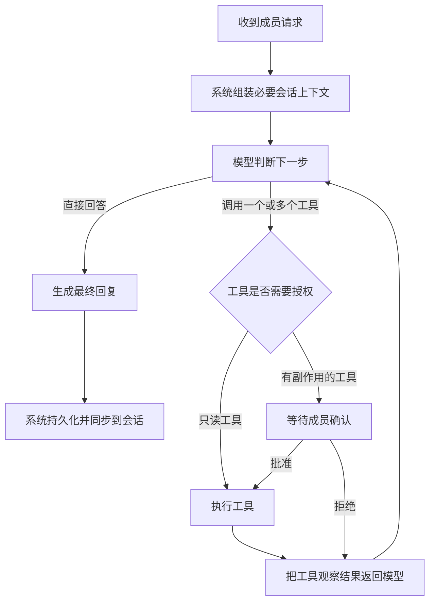

# Union Talk 动态 Agent 交互流程

## 目标

会话 Agent 不再执行固定的“读取、检索、生成、保存”流水线。系统只提供安全边界、工具目录和最大执行轮次；模型在每一轮根据当前请求、已有上下文和工具结果决定下一步。

界面只展示真实发生的成员可见事件，不预先创建空步骤，也不根据固定 `stepCode` 猜测文案。

## 运行闭环

当前版本已经实现模型原生工具选择、工具结果回传、多轮判断、失败后继续和最终回答。当前注册工具只有只读的 `search_conversation_knowledge`，因此不会出现授权中断；将来接入发送消息、修改数据等有副作用工具时，再启用图中的确认节点。

## 模型每轮可选择的动作

1. **最终回答**：不返回工具调用，当前文本即最终回复。
2. **调用工具**：返回一个或多个结构化工具调用；系统执行后把结果作为 `tool` 消息送入下一轮。
3. **继续迭代**：模型拿到工具结果后可以再次调用工具，不限制为一次检索。
4. **恢复失败**：单个工具失败会形成失败事件和结构化错误观察，模型可以改参数重试、选择其他工具或使用已有信息回答。

系统保留八轮模型调用上限、回答长度上限、工具参数校验、取消检查和可见性过滤。这些是安全边界，不是业务流程。

## 执行事件协议

成员可见轨迹由服务端真实事件驱动：

| 字段 | 作用 |
| --- | --- |
| `sequence` | 保证事件按真实发生顺序展示 |
| `stepType` | 区分模型判断、工具调用等活动类型 |
| `displayName` | 服务端提供的活动名称，前端不根据步骤编码改写 |
| `status` | `RUNNING`、`SUCCEEDED`、`FAILED`、`SKIPPED` 或 `CANCELLED` |
| `inputSummary` | 脱敏后的工具参数或上下文摘要 |
| `outputSummary.summary` | 服务端根据真实结果生成的一句话摘要 |
| `outputSummary` | 脱敏后的结构化结果 |
| `visibility` | `MEMBER`、`ADMIN` 或 `INTERNAL` |

系统组装上下文和持久化回复属于 `INTERNAL`，不伪装成模型自主行为。模型判断和实际选择的工具属于 `MEMBER`，进入用户看到的时间线。

## 前端交互

1. 打开执行详情后按 `sequence` 渲染时间线。
2. 运行中的 Run 每 800ms 增量刷新轨迹，新的真实事件在发生后追加。
3. 每个工具事件就地展开自己的输入与结果，不再使用统一的“查看所有工具结果”区域。
4. 失败事件保留在原位置；后续重试或其他动作继续追加，不把失败强制当作整次 Run 的终点。
5. 最终回复独立展示，并标记是否已经同步到会话。
6. 内部步骤不展示，模型私有思维链不记录、不返回，也不在界面模拟。

## 后续接入有副作用工具

新增工具时需要同时声明风险级别：

- `READ_ONLY`：允许直接执行。
- `CONFIRM`：创建等待确认事件，用户批准后续跑同一个 Run。
- `DENY`：不向模型暴露或直接返回策略拒绝结果。

等待确认和等待补充信息应作为 Run 的可恢复状态，而不是新的固定页面步骤。确认、拒绝或补充信息都作为观察结果重新进入同一个模型循环。
