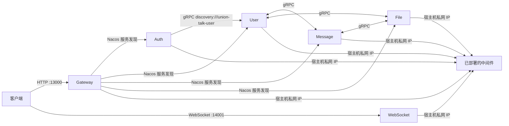

# Union Talk Docker 部署说明

本文档用于在同一台 Linux 主机上部署 Union Talk 的六个后端服务。部署端只拉取镜像，不在服务器上编译源码。生产 Tag、GHCR、前端和 Agent 的自动部署流程见仓库根目录的 [`docs/production-release.md`](../../../docs/production-release.md)。

## 1. 部署结构

六个应用分别由一个 Compose 文件管理：

| 服务 | Compose 文件 | 容器 HTTP | 容器 gRPC | 宿主机端口 |
|---|---|---:|---:|---:|
| Gateway | `docker-compose.gateway.yaml` | 13000 | — | 13000 |
| Auth | `docker-compose.auth.yaml` | 13001 | — | 不映射 |
| User | `docker-compose.user.yaml` | 13003 | 19003 | 不映射 |
| Message | `docker-compose.message.yaml` | 13005 | 19005 | 不映射 |
| WebSocket | `docker-compose.websocket.yaml` | 13004 | — | 14001 → 14001 |
| File | `docker-compose.file.yaml` | 13006 | 19006 | 不映射 |

所有容器加入已有的外部 Docker 网络 `union-talk`。Nacos、PostgreSQL、Redis、RabbitMQ、Seata、MinIO 等中间件通过宿主机私网 IP 和宿主机映射端口访问。



## 2. 前置条件

部署前确认：

1. 已安装 Docker Engine 和 Docker Compose V2，可执行 `docker compose version`。
2. 六个镜像已经由 CI 或构建机推送到镜像仓库。
3. 部署主机能登录镜像仓库。
4. 已部署并可访问 Nacos、PostgreSQL、Redis、RabbitMQ、Seata 和 MinIO。
5. 宿主机防火墙允许 Docker Bridge 网段访问中间件的映射端口。
6. PostgreSQL 已包含业务所需数据库；Seata Server 表与 AT 模式的 `undo_log` 已初始化。
7. Nacos 中存在 Namespace，且 `.env` 填写的是 **Namespace ID**，不是只填写界面显示名称。

本仓库的 File 模块已提供 Dockerfile。镜像应在 CI 或构建机提前构建并推送，部署机只负责拉取镜像。

## 3. 配置边界

### 3.1 放在 `.env` 的内容

以下内容与部署环境或凭据相关，放在本机 `.env`，不要提交到 Git：

- 镜像仓库与镜像标签；
- 宿主机私网 IP 和中间件端口；
- Nacos、PostgreSQL、Redis、RabbitMQ、MinIO、SMTP 的账号密码；
- 应用加密密钥；
- JVM、日志、雪花 ID 和对外端口。

### 3.2 放在 Nacos 的内容

Nacos 保存可集中维护的配置结构：

- 日志、Sa-Token、连接池、Flyway、MyBatis；
- RabbitMQ 客户端参数；
- Seata 客户端事务组和 TC 地址；
- HTTP 端口、Gateway 路由；
- gRPC Server 和 Client；
- WebSocket、文件上传、对象存储参数。

Nacos 文件中的敏感项使用 `${ENV_NAME}`，实际值仍由容器环境变量提供。例如：

```yaml
spring:
  datasource:
    password: ${UNION_POSTGRESQL_PASSWORD}
```

Nacos 服务端不会替容器解析这个值；应用从 Nacos 拉取配置后，由 Spring 使用容器环境变量完成解析。

### 3.3 必须保留在镜像中的内容

`spring.application.name`、Nacos Bootstrap 配置、`spring.config.import`、Flyway SQL、Java 自动配置和业务代码必须留在镜像中。修改这些内容后，镜像必须基于当前代码重新构建并推送；部署服务器本身仍只执行 `pull`。

## 4. 准备部署目录

进入部署目录：

```bash
cd union-talk-server/deploy/docker
```

复制环境模板：

```bash
cp .env.example .env
chmod 600 .env
```

编辑 `.env`，至少替换：

- `UNION_TALK_IMAGE_PREFIX`
- `UNION_TALK_IMAGE_TAG`（生产使用完整 Tag，例如 `v1.2.3` 或 `gateway-v1.2.4`）
- 所有示例宿主机 IP
- 所有 `change-me`
- `UNION_CRYPTO_SECRET_KEY`

中间件位于宿主机时，`*_HOST` 必须填写宿主机私网 IP，不能填写 `127.0.0.1` 或 `localhost`。容器里的 `127.0.0.1` 只代表容器自身。

如果镜像仓库需要认证：

```bash
docker login registry.example.com
```

## 5. 创建外部网络

先检查：

```bash
docker network inspect union-talk
```

如果网络不存在，再创建：

```bash
docker network create union-talk
```

如果已部署的中间件容器也需要通过容器名互访，可将它们加入该网络；本方案中的业务容器访问中间件使用宿主机私网 IP，因此不是强制要求。

## 6. 导入 Nacos 配置

在 Nacos 控制台选择：

```text
Namespace ID: union-talk
Group: DEFAULT_GROUP
配置格式: YAML
```

如果实际 Namespace ID 不是 `union-talk`，以实际 ID 为准，并同步修改 `.env` 中的 `UNION_NACOS_NAMESPACE`。

将 `nacos/` 目录下文件分别创建为同名 Data ID：

| Data ID | 使用方 |
|---|---|
| `union-talk-common.yaml` | 六个服务 |
| `union-talk-datasource.yaml` | User、Message、File |
| `union-talk-rabbitmq.yaml` | User、Message、WebSocket |
| `union-talk-seata.yaml` | User、Message、File |
| `union-talk-gateway-local.yaml` | Gateway |
| `union-talk-auth-local.yaml` | Auth |
| `union-talk-user.yaml` | User |
| `union-talk-message.yaml` | Message |
| `union-talk-websocket.yaml` | WebSocket |
| `union-talk-file.yaml` | File |

导入前先备份 Nacos 中已有同名 Data ID。导入后检查 Group、Namespace 和 YAML 格式，尤其不要把文件名导入成 `.yaml.yaml`。

### gRPC 配置说明

以下地址可以放在 Nacos 中，本交付已经这样配置：

```yaml
grpc:
  client:
    union-talk-message:
      address: discovery:///union-talk-message
      negotiation-type: plaintext
```

`discovery:///union-talk-message` 通过 Spring Cloud DiscoveryClient 从 Nacos 查找实例，不需要把业务容器 IP 写进 `.env`。修改 gRPC 地址、端口或协商方式后，应重启消费该配置的服务，避免已有 Channel 继续使用旧参数。

## 7. Seata 配置说明

业务服务使用的 `nacos/union-talk-seata.yaml` 是 **Seata Client 配置**，只需要事务组和 Seata Server 地址，不需要 PostgreSQL 用户、密码。

Seata Server 自己要保存全局事务、分支事务和锁，因此当 `store.mode=db` 时仍然必须配置 PostgreSQL。该配置只需在 Seata Server 的容器环境或它自己的配置中心中维护一份，不要同时维护两份互相覆盖的值。

本方案让业务服务通过宿主机私网 IP 直接访问 TC：

```yaml
seata:
  registry:
    type: file
  service:
    grouplist:
      default: ${UNION_SEATA_HOST}:${UNION_SEATA_PORT:8091}
```

Seata Server 是否注册到 Nacos 不影响这种直连方式。需要确认：

- Seata Server 实际监听并映射 `8091`；
- `vgroup-mapping.default_tx_group=default` 与 `grouplist.default` 名称一致；
- Seata Server 数据库中有 `global_table`、`branch_table`、`lock_table`、`distributed_lock`；
- 每个使用 AT 模式的业务库中有 `undo_log`；
- Seata Server 日志没有 Nacos API 不兼容或注册失败。

如果未来改为 Seata Client 也通过 Nacos 发现 TC，再把 Client 的 `registry.type` 改为 `nacos` 并提供匹配的 Namespace、Group、Application；不要同时保留直连和 Nacos 两套来源。

## 8. 拉取镜像

逐个拉取：

```bash
docker compose --env-file .env -f docker-compose.user.yaml pull
docker compose --env-file .env -f docker-compose.message.yaml pull
docker compose --env-file .env -f docker-compose.file.yaml pull
docker compose --env-file .env -f docker-compose.auth.yaml pull
docker compose --env-file .env -f docker-compose.websocket.yaml pull
docker compose --env-file .env -f docker-compose.gateway.yaml pull
```

六个 Compose 都没有 `build:`，不会在部署服务器编译镜像。

## 9. 启动服务

User、Message、File 之间存在循环 gRPC 调用，客户端会通过服务发现和重连机制等待其他实例上线。先启动这三个核心服务：

```bash
docker compose --env-file .env -f docker-compose.user.yaml up -d
docker compose --env-file .env -f docker-compose.message.yaml up -d
docker compose --env-file .env -f docker-compose.file.yaml up -d
```

再启动 Auth 和 WebSocket：

```bash
docker compose --env-file .env -f docker-compose.auth.yaml up -d
docker compose --env-file .env -f docker-compose.websocket.yaml up -d
```

最后启动 Gateway：

```bash
docker compose --env-file .env -f docker-compose.gateway.yaml up -d
```

## 10. 部署验证

### 10.1 检查容器

```bash
docker ps --filter name=union-talk-
```

应看到六个容器处于 `Up` 状态。

### 10.2 检查日志

```bash
docker logs --tail 200 union-talk-user
docker logs --tail 200 union-talk-message
docker logs --tail 200 union-talk-file
docker logs --tail 200 union-talk-auth
docker logs --tail 200 union-talk-websocket
docker logs --tail 200 union-talk-gateway
```

重点检查：

- 已从正确的 Nacos Namespace 和 Group 加载十个 Data ID；
- 六个服务均成功注册到 Nacos；
- PostgreSQL、Redis、RabbitMQ、Seata、MinIO 连接成功；
- User、Message、File 的 gRPC Server 监听 19003、19005、19006；
- 日志中没有访问 `127.0.0.1` 中间件的错误；
- 没有 unresolved placeholder、Data ID not found 或 YAML 解析异常。

### 10.3 检查网络

```bash
docker network inspect union-talk
```

网络的 `Containers` 中应包含六个应用容器。

从业务容器验证宿主机中间件端口，例如：

```bash
docker exec union-talk-user sh -c 'nc -zvw3 "$UNION_POSTGRESQL_HOST" "$UNION_POSTGRESQL_PORT"'
docker exec union-talk-user sh -c 'nc -zvw3 "$UNION_SEATA_HOST" "$UNION_SEATA_PORT"'
```

如果镜像没有 `nc`，可根据应用日志判断，或从同一网络启动临时诊断容器。

### 10.4 检查 Nacos

在 Nacos 服务列表中确认：

```text
union-talk-gateway
union-talk-auth
union-talk-user
union-talk-message
union-talk-websocket
union-talk-file
```

实例 IP 应是 `union-talk` Docker 网络中其他业务容器可访问的地址，端口应分别为 13000、13001、13003、13005、13004、13006。

### 10.5 检查对外入口

Gateway：

```bash
curl -i http://127.0.0.1:13000/api/v1/
```

具体业务接口应通过以下前缀访问：

```text
/api/v1/auth/**
/api/v1/user/**
/api/v1/message/**
/api/v1/file/**
```

WebSocket：

```text
ws://<宿主机IP>:14001/api/v1/ws
```

根路径如果返回 404 并不表示服务未启动，应使用项目真实接口或查看容器日志。

## 11. 查看状态与日志

查看单个服务状态：

```bash
docker compose --env-file .env -f docker-compose.gateway.yaml ps
```

持续查看日志：

```bash
docker compose --env-file .env -f docker-compose.gateway.yaml logs -f --tail 200
```

其他服务只需替换 Compose 文件名。

## 12. 更新镜像

将 `.env` 的 `UNION_TALK_IMAGE_TAG` 改为新的、不可变的版本标签，然后对目标服务执行：

```bash
docker compose --env-file .env -f docker-compose.gateway.yaml pull
docker compose --env-file .env -f docker-compose.gateway.yaml up -d --force-recreate
docker compose --env-file .env -f docker-compose.gateway.yaml logs --tail 200
```

依次滚动更新核心服务时，建议顺序：

```text
File → Message → User → Auth → WebSocket → Gateway
```

不要使用不可追踪的 `latest` 作为生产标签。

## 13. 回滚

将 `.env` 中的 `UNION_TALK_IMAGE_TAG` 恢复到上一个已验证版本，然后：

```bash
docker compose --env-file .env -f docker-compose.gateway.yaml pull
docker compose --env-file .env -f docker-compose.gateway.yaml up -d --force-recreate
```

回滚前确认旧镜像标签仍保留在镜像仓库。Nacos 配置变更也应提前导出备份；如果新版镜像依赖了新版配置，镜像和 Nacos 配置需要一起回滚。

## 14. 停止服务

停止并移除某个应用容器，不会删除外部网络或中间件：

```bash
docker compose --env-file .env -f docker-compose.gateway.yaml down
```

应用日志保留在：

```text
deploy/docker/data/logs/<service>/
```

## 15. 常见问题

### 15.1 容器连接宿主机中间件失败

检查 `.env` 是否使用宿主机私网 IP，并确认中间件监听地址不是只绑定 `127.0.0.1`。同时检查宿主机防火墙和 Docker Bridge 网段访问策略。

### 15.2 Nacos 中有配置但应用提示找不到

逐项核对：

- `.env` 中是 Namespace ID；
- Data ID 完整包含 `.yaml`；
- Group 是 `DEFAULT_GROUP`；
- Nacos 端口是客户端 API 端口；
- 容器能访问宿主机 Nacos 映射端口；
- 镜像包含本次更新后的 `spring.config.import`。

### 15.3 服务已注册，但 Gateway 或 gRPC 无法访问

检查 Nacos 中实例 IP 是否能从 Gateway/调用方容器访问，并确认六个容器都在 `union-talk` 网络。不要把 gRPC 地址写为宿主机 HTTP 端口，应继续使用 `discovery:///服务名`。

### 15.4 Seata 启动后回退到 file 存储

Seata Server 的 `store.mode=db` 和 PostgreSQL 连接是服务端配置，不能只放在业务服务的 `union-talk-seata.yaml`。检查 Seata Server 启动日志，确认最终生效配置来源以及四张 Server 表。

### 15.5 Seata 连接 Nacos 出现 API 404 或兼容性异常

核对 Seata 镜像内置的 Nacos Client 与 Nacos Server 版本是否兼容。不要只依据 Seata 镜像标签判断其内置依赖版本；以启动日志和镜像内依赖为准。升级前先在测试环境验证注册、配置读取和事务提交/回滚。

### 15.6 配置修改后没有立即生效

端口、数据源、gRPC Channel、Seata 和部分连接池参数不适合依赖热刷新。修改这些配置后，重建对应容器：

```bash
docker compose --env-file .env -f docker-compose.user.yaml up -d --force-recreate
```

## 16. 安全检查

- `.env` 权限建议为 `600`，且已被本目录 `.gitignore` 排除；
- 不要把真实 `.env` 上传到服务器之外的共享位置；
- 不要在 Nacos YAML 中写明文密码；
- Nacos 控制台、Druid 监控页和中间件管理端口不要直接暴露到公网；
- 如果密钥曾出现在 Git、日志、聊天或终端历史中，删除文本并不足以保证安全，必须到对应平台轮换密钥；
- 生产环境建议使用专用凭据管理系统向容器注入秘密。
